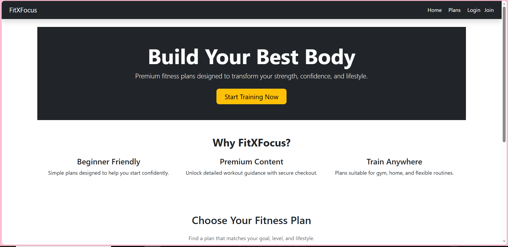
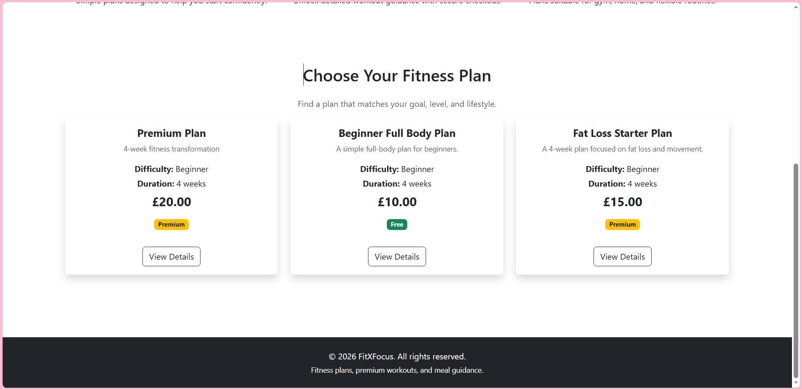
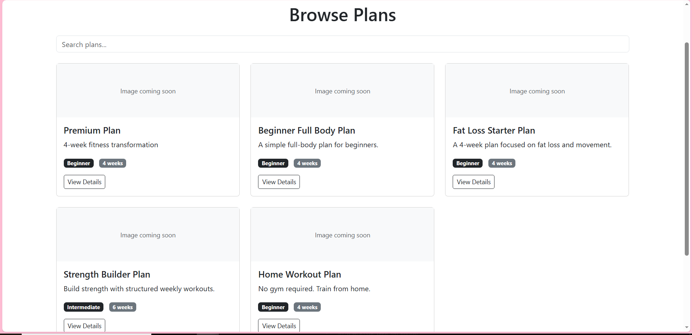
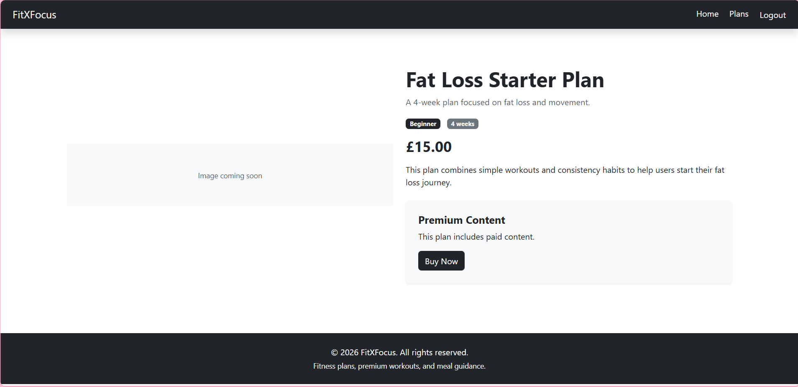
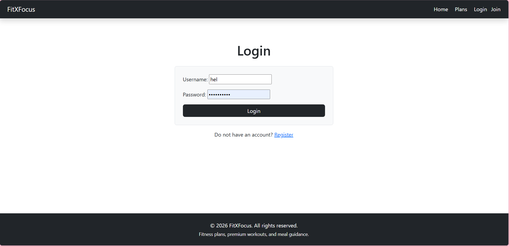
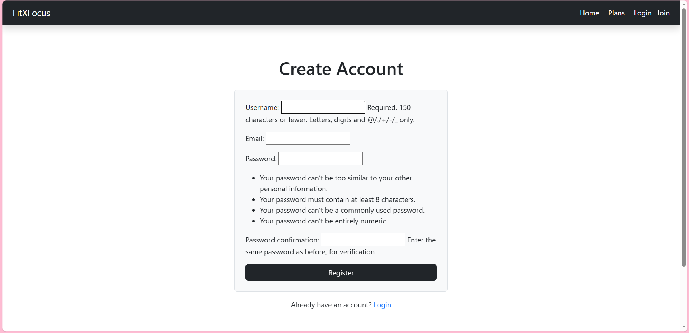
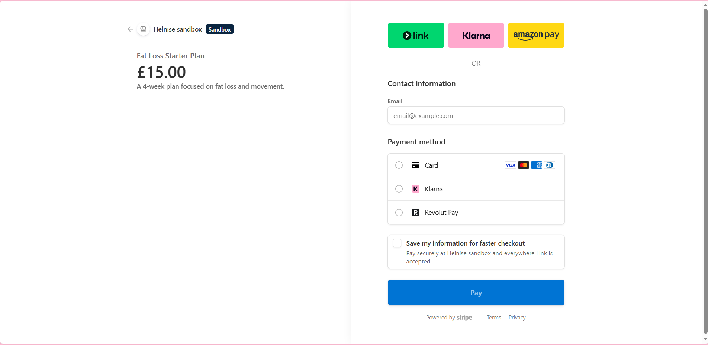
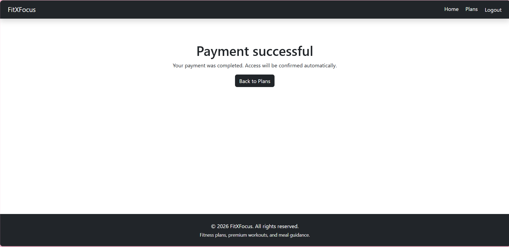
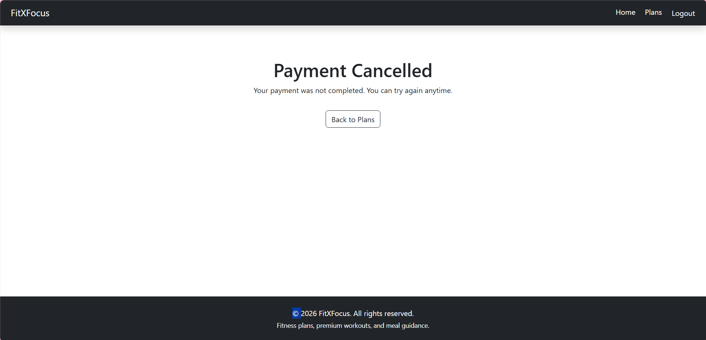
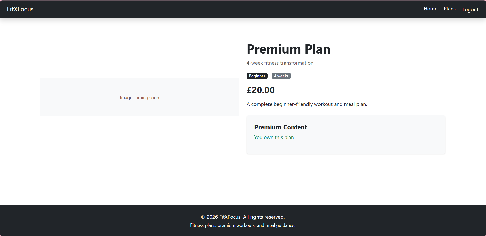

# FitXFocus

FitXFocus is a full-stack fitness web application developed using Django. The platform allows users to browse structured workout plans, register and log in securely, and purchase premium fitness content through Stripe Checkout.

The application demonstrates a real-world software development lifecycle, including planning, design, database modelling, CRUD functionality, authentication, payment integration, testing, deployment, and third-party service integration.

---

## Live Project

[View FitXFocus Live](https://shrouded-ridge-70786-31835d78642e.herokuapp.com/)

---

## Contents

- [Project Overview](#project-overview)
- [UX Design](#ux-design)
  - [Project Goals](#project-goals)
  - [User Goals](#user-goals)
  - [User Stories](#user-stories)
- [Design and Planning](#design-and-planning)
  - [Wireframes](#wireframes)
  - [Design Choices](#design-choices)
- [Features](#features)
  - [Existing Features](#existing-features)
  - [Future Features](#future-features)
- [Database Schema](#database-schema)
- [Business Logic and Payment Flow](#business-logic-and-payment-flow)
- [CRUD Functionality Summary](#crud-functionality-summary)
- [Finished Product](#finished-product)
- [Technologies Used](#technologies-used)
- [Testing](#testing)
- [Deployment](#deployment)
- [Security and Environment Variables](#security-and-environment-variables)
- [Performance and Accessibility](#performance-and-accessibility)
- [Credits](#credits)

---

# Project Overview

FitXFocus was created as a full-stack Django web application for users who want access to structured workout plans. The website allows visitors to browse fitness plans, register for an account, log in, purchase premium plans using Stripe, and unlock premium content after payment.

The project is designed to show practical understanding of:

- Django project structure
- Multiple Django apps
- Relational database design
- User authentication
- CRUD functionality
- Stripe Checkout integration
- Stripe webhook handling
- Heroku deployment
- PostgreSQL production database
- Secure use of environment variables

FitXFocus is not a static website. It is a dynamic web application where the content changes depending on the logged-in user, the workout plans stored in the database, and the user’s payment status.

---

# UX Design

## Project Goals

The main goals of the project are:

- Build a full-stack Django web application
- Provide users with access to fitness plans
- Allow users to purchase premium content
- Store and manage user purchases
- Use Stripe for secure payment handling
- Deploy the finished application to Heroku
- Demonstrate real-world web development practices

---

## User Goals

Users should be able to:

- Understand what the website offers
- Browse available workout plans
- Register for an account
- Log in and log out securely
- View detailed information about plans
- Purchase premium plans securely
- Access premium content after payment
- Use the website on desktop and mobile devices

---

## User Stories

### First-Time Visitor

- As a first-time visitor, I want to understand what FitXFocus offers so I can decide whether it is useful to me.
- As a first-time visitor, I want to browse workout plans before registering.
- As a first-time visitor, I want to create an account easily.

### Registered User

- As a registered user, I want to log in securely so the website can identify me.
- As a registered user, I want to view premium plans so I can choose one to purchase.
- As a registered user, I want to pay securely using Stripe.
- As a registered user, I want the website to remember my purchase so I do not need to buy the same plan again.

### Admin User

- As an admin user, I want to create workout plans so I can add content to the website.
- As an admin user, I want to update workout plans so I can keep the site accurate.
- As an admin user, I want to delete outdated plans.
- As an admin user, I want to view purchases to confirm payment activity.

---

# Design and Planning

## Wireframes

Wireframes were used to plan the layout and flow before development.

### Home Page Wireframe

The home page was planned to include:

- Navigation bar
- Hero section
- Call-to-action button
- Popular plans section


---

### Plans Page Wireframe

The plans page was planned to include:

- List of available workout plans
- Plan cards
- Plan price
- View Details button


---

### Plan Detail Page Wireframe

The plan detail page was planned to include:

- Plan title
- Plan description
- Difficulty
- Duration
- Price
- Buy Now button
- Premium content unlock message


---

### Checkout Flow Wireframe

The checkout flow was planned to include:

- Buy Now button
- Stripe hosted checkout page
- Payment success page
- Return to plan page


---

## Design Choices

### Typography

The typography was kept simple and readable. The aim was to make the platform easy to use for visitors who want to quickly browse fitness plans and understand what each plan includes.

### Colour Scheme

The colour scheme is clean and simple:

- Dark navigation bar for contrast
- Light background for readability
- Green buttons for purchase actions
- Blue buttons for primary calls to action
- Neutral text colours for descriptions

### Media

Fitness-related images can be used to make the site more engaging. Images should be compressed and optimised before being uploaded to avoid slowing the website down.

### Responsiveness

The website was designed to work across:

- Desktop
- Laptop
- Tablet
- Mobile

Bootstrap is used to help create a responsive layout.

### Accessibility Considerations

Accessibility considerations include:

- Clear navigation links
- Readable text
- Simple layout
- Descriptive buttons
- Good contrast between text and background
- Semantic HTML where possible

---

# Features

## Existing Features

### Navigation Bar

The navigation bar allows users to move between key pages.

It includes links to:

- Home
- Plans
- Login
- Join/Register
- Logout when authenticated

---

### User Authentication

Users can register, log in, and log out.

Authentication is important because purchases must be linked to a specific user account.

---

### Workout Plan Listing

Workout plans are stored in the database and displayed dynamically on the website.

Each plan can include:

- Title
- Slug
- Short description
- Full description
- Difficulty
- Duration
- Price
- Premium status

---

### Plan Detail Page

Each workout plan has its own detail page.

The detail page displays:

- Plan title
- Description
- Difficulty
- Duration
- Price
- Premium status
- Buy Now button if the user has not purchased the plan
- Unlocked content message if the user has purchased the plan

---

### Stripe Checkout

Stripe Checkout is used for payment processing.

When a user clicks Buy Now:

1. Django creates or finds a Purchase record.
2. Django creates a Stripe Checkout Session.
3. The user is redirected to Stripe.
4. The user completes payment.
5. Stripe redirects the user back to the success page.

---

### Premium Content Unlock

Premium content is unlocked when a Purchase object has `paid=True`.

If the user has not paid, the page displays:

```text
This plan includes paid content. Buy to unlock full access.

If the user has paid, the page displays:

```text
You own this plan.
Full premium content unlocked.
```

---

### Stripe Webhook

The webhook endpoint listens for successful checkout events.

**Webhook endpoint:**

```text
/checkout/webhook/
```

**Stripe event used:**

```text
checkout.session.completed
```

The webhook updates the `Purchase` model and marks the purchase as paid.

---

### Django Admin

The Django admin panel is used to manage:

- Users
- Workout plans
- Purchases

This allows the admin user to create, update, and delete workout plans without editing code.

---

## Future Features

Future improvements could include:

- User dashboard
- Purchased plans page
- Workout progress tracking
- Email confirmation after purchase
- Monthly subscriptions
- Reviews and ratings
- Search and filter functionality
- Better image handling
- Password reset functionality
- Improved mobile UI
- More detailed analytics for admin users

---

# Database Schema

The database is designed around users, workout plans, and purchases.

## User Model

The project uses Django’s built-in `User` model for authentication.

The `User` model stores:

- Username
- Email
- Password
- Authentication details


## WorkoutPlan Model

The `WorkoutPlan` model stores fitness plan information.

### Example Structure

```python
class WorkoutPlan(models.Model):
    title = models.CharField(max_length=200)
    slug = models.SlugField(unique=True)
    short_description = models.CharField(max_length=255)
    description = models.TextField()
    difficulty = models.CharField(max_length=20)
    duration_weeks = models.PositiveIntegerField(default=4)
    price = models.DecimalField(max_digits=6, decimal_places=2)
    is_premium = models.BooleanField(default=True)
    image = models.ImageField(upload_to='plans/', blank=True, null=True)
    video_url = models.URLField(blank=True, null=True)
```

### Purpose

- Stores plan content  
- Allows the admin to manage plans  
- Allows users to browse and view plan details  

---

## Purchase Model

The `Purchase` model links users to the workout plans they have bought.

### Example Structure

```python
class Purchase(models.Model):
    user = models.ForeignKey(settings.AUTH_USER_MODEL, on_delete=models.CASCADE)
    plan = models.ForeignKey(WorkoutPlan, on_delete=models.CASCADE)
    stripe_checkout_session_id = models.CharField(max_length=255, blank=True, null=True)
    paid = models.BooleanField(default=False)
    purchased_at = models.DateTimeField(auto_now_add=True)
```

### Purpose

- Tracks which user bought which plan  
- Stores Stripe checkout session ID  
- Stores payment status  
- Controls access to premium content  

---

## Database Relationship Summary

```text
User 1 → many Purchases
WorkoutPlan 1 → many Purchases
Purchase belongs to one User and one WorkoutPlan
```

### Explanation

- A user can purchase many plans  
- A plan can be purchased by many users  
- A purchase connects one user to one plan  

---

# Business Logic and Payment Flow

## Payment Flow

```text
User clicks Buy Now
        ↓
Django creates/fetches Purchase object
        ↓
Django creates Stripe Checkout Session
        ↓
User completes payment on Stripe
        ↓
Stripe redirects user to success page
        ↓
Stripe sends webhook event
        ↓
Django marks Purchase.paid = True
        ↓
Premium content unlocks
```

---

## Access Logic

The plan detail page checks whether the current logged-in user has a paid purchase for that plan.

### Example Logic

```python
has_purchased = Purchase.objects.filter(
    user=request.user,
    plan=plan,
    paid=True
).exists()
```

If `has_purchased` is true, the user sees unlocked premium content.  
Otherwise, they see the **Buy Now** button.

---

# CRUD Functionality Summary

CRUD stands for:

- Create  
- Read  
- Update  
- Delete  

| Model        | Create                          | Read                           | Update             | Delete       |
|-------------|----------------------------------|--------------------------------|--------------------|--------------|
| User        | Register form                    | Login/auth system              | Admin only         | Admin only   |
| WorkoutPlan | Admin panel                      | Public plan pages              | Admin panel        | Admin panel  |
| Purchase    | Created automatically at checkout| Admin & access checks          | Webhook/admin      | Admin only   |

---

## User CRUD

### Create
Users can create an account through the registration page.

### Read
The application reads user information for login state, ownership checks, and purchase records.

### Update
User updates can be managed through Django admin.

### Delete
User deletion is available through Django admin.

---

## WorkoutPlan CRUD

### Create
Admin users can create workout plans from the Django admin panel.

### Read
Users can view workout plans on the home page, plans page, and plan detail page.

### Update
Admin users can update plan details.

### Delete
Admin users can delete outdated plans.

---

## Purchase CRUD

### Create
Purchase records are created automatically when the user starts checkout.

### Read
Purchase records are used to determine whether premium content should be unlocked.

### Update
Purchase records are updated when Stripe confirms payment.

### Delete
Purchase records can be deleted from Django admin if required.


# Finished Product

The finished product is a deployed Django fitness platform.

## Live Site

https://shrouded-ridge-70786-31835d78642e.herokuapp.com/

---

## Features Included

- Home page  
- Workout plan display  
- Plan detail page  
- User authentication  
- Stripe Checkout integration  
- Payment success page  
- Premium content unlock logic  
- Django admin management  
- Heroku deployment  
- PostgreSQL production database  

---

## Finished Product Screenshots

### Home Page




---

### Plans Page



---

### Plan Detail Page



---

### Login Page


---

### Register Page


---

### Stripe Checkout



---

### Payment Success Page


---

### Payment Cancel Page


---

### Premium Content Unlocked



---

# Technologies Used

## Languages

- Python  
- HTML  
- CSS  
- JavaScript  

---

## Frameworks and Libraries

- Django  
- Bootstrap  
- Stripe Python package  
- WhiteNoise  
- dj-database-url  
- Gunicorn  

---

## Database

- SQLite (local development)  
- PostgreSQL (production on Heroku)  

---

## Platforms and Tools

- Git  
- GitHub  
- Heroku  
- Stripe Dashboard  
- VS Code  
- Heroku CLI  
- Chrome DevTools  

---

# Testing

Testing was carried out manually during development and deployment.

## Manual Testing

| Test              | Action                      | Expected Result                | Result |
|------------------|---------------------------|-------------------------------|--------|
| Home page loads  | Visit homepage             | Homepage displays             | Pass   |
| Plans display    | Add plan in admin          | Plan appears on homepage      | Pass   |
| View details     | Click View Details         | Plan detail page loads        | Pass   |
| Register         | Submit registration form   | User account created          | Pass   |
| Login            | Enter valid credentials    | User logs in                  | Pass   |
| Logout           | Click logout               | User logs out                 | Pass   |
| Buy button       | Click Buy Now              | Redirects to Stripe           | Pass   |
| Stripe payment   | Use test card              | Payment succeeds              | Pass   |
| Success page     | Complete payment           | Success page displays         | Pass   |
| Premium unlock   | Purchase marked paid       | Content unlocks               | Pass   |
| Admin access     | Visit /admin/              | Admin page loads              | Pass   |
| Add plan         | Create plan in admin       | Plan saved to database        | Pass   |

---

## Stripe Testing

Stripe test card used:

```text
4242 4242 4242 4242
```

Other test values:

```text
Expiry: Any future date
CVC: Any 3 digits
Postcode: Any valid value
```

---

## Webhook Testing

**Webhook endpoint:**

```text
https://shrouded-ridge-70786-31835d78642e.herokuapp.com/checkout/webhook/
```

**Expected Heroku log:**

```text
POST /checkout/webhook/ 200
```

---

## Known Issues

During development, a known issue occurred where Stripe payment completed but the plan did not unlock immediately.

### Cause

- Stripe webhook delivery required additional configuration and testing.

### Temporary Solution

- The purchase could be manually marked as paid in Django admin.

### Long-Term Solution

- Ensure the Stripe webhook listens for:

```text
checkout.session.completed
```

- Update the database:

```python
purchase.paid = True
```

This ensures premium content is unlocked automatically after payment.